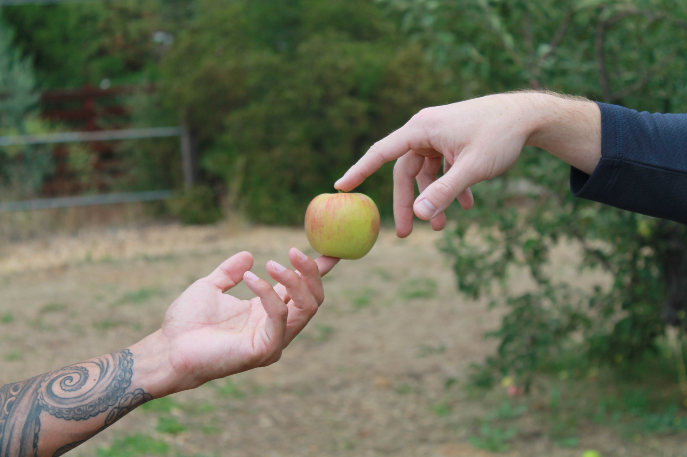

# first_repo
Practice for repository and readme file using markdown

## Introductions
Hi there! My name is *Amanda*.

I'm a ***web development student*** at San Diego College of Continuing Education.

In my free time, I like to:
* bake
* practice yoga
* read
* snowboard

Three terms I've learned from this exercise are:
1. respository
2. markdown
3. readme file

Here's a photo that I took recently for my digital photography class. Changes.

If you're looking to connect, check out my profile on [LinkedIn](https://www.linkedin.com/in/amandamknight/).
